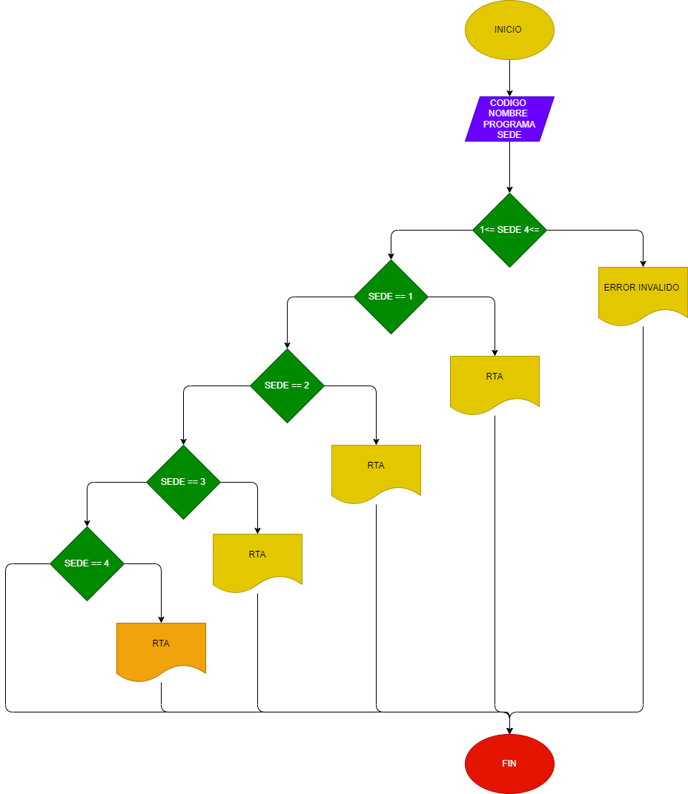

# Programa del proyecto de fundamentos de programación
Crear una aplicación de fácil acceso, en la cual se desarrolle un apartado donde se pueda rentar bicicletas para el uso de cualquier estudiante.

 Diseñar en un programa que ayude a resolver la problemática de la renta de bicicletas para los estudiantes UIS.
 Desarrollar en visual estudio un código el cual nos permita ayudar a los estudiantes que tiene esta problemática.
 Implementar en las intalaciones de la UIS un programa con el cual se busque soluciones a las personas que deseen este servicio facilitando el medio por el cual puedan reservar el bicicleta . 

Nombre del protecto "UIS BIKE RENTAL"

